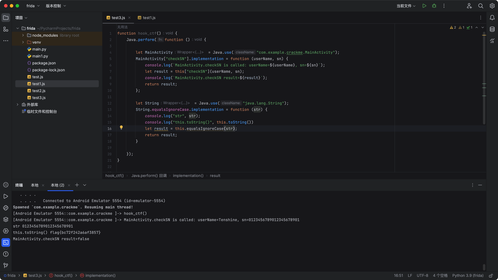

# Function

## onCreate

```java
    public void onCreate(Bundle savedInstanceState) {
        super.onCreate(savedInstanceState);
        setContentView(R.layout.activity_main);
        setTitle(R.string.unregister);
        this.edit_userName = "Tenshine";
        this.edit_sn = (EditText) findViewById(R.id.edit_sn);
        this.btn_register = (Button) findViewById(R.id.button_register);
        this.btn_register.setOnClickListener(new View.OnClickListener() { // from class: com.example.crackme.MainActivity.1
            @Override // android.view.View.OnClickListener
            public void onClick(View v) {
                if (!MainActivity.this.checkSN(MainActivity.this.edit_userName.trim(), MainActivity.this.edit_sn.getText().toString().trim())) {
                    Toast.makeText(MainActivity.this, (int) R.string.unsuccessed, 0).show();
                    return;
                }
                Toast.makeText(MainActivity.this, (int) R.string.successed, 0).show();
                MainActivity.this.btn_register.setEnabled(false);
                MainActivity.this.setTitle(R.string.registered);
            }
        });
    
```

userName为Tenshine，sn需要输入。

## checkSN

```java
    public boolean checkSN(String userName, String sn) {
        if (userName != null) {
            try {
                if (userName.length() == 0 || sn == null || sn.length() != 22) {
                    return false;
                }
                MessageDigest digest = MessageDigest.getInstance("MD5");
                digest.reset();
                digest.update(userName.getBytes());	//userName.md5
                byte[] bytes = digest.digest();
                String hexstr = toHexString(bytes, "");
                StringBuilder sb = new StringBuilder();
                for (int i = 0; i < hexstr.length(); i += 2) {
                    sb.append(hexstr.charAt(i));
                }
                String userSN = sb.toString();
                return new StringBuilder().append("flag{").append(userSN).append("}").toString().equalsIgnoreCase(sn);	//直接比较了，都不用逆向，直接丢java跑一下试试。
            } catch (NoSuchAlgorithmException e) {
                e.printStackTrace();
                return false;
            }
        }
        return false;
    }
```

## toHexString

```java
    private static String toHexString(byte[] bytes, String separator) {	//md5就这样算出来的？？？
        StringBuilder hexString = new StringBuilder();
        for (byte b : bytes) {
            String hex = Integer.toHexString(b & 255);
            if (hex.length() == 1) {
                hexString.append('0');
            }
            hexString.append(hex).append(separator);
        }
        return hexString.toString();
    }
```

# 算法

## java

```java
import java.security.MessageDigest;
import java.security.NoSuchAlgorithmException;

public class Main {
    public static void main(String[] args) {
        String UserName = "Tenshine";
        String sn = "0123456789012345678901";
        checkSN(UserName, sn);
    }

    public static boolean checkSN(String userName, String sn) {
        if (userName != null) {
            try {
                if (userName.length() == 0 || sn == null || sn.length() != 22) {
                    return false;
                }
                MessageDigest digest = MessageDigest.getInstance("MD5");
                digest.reset();
                digest.update(userName.getBytes());
                byte[] bytes = digest.digest();
                String hexstr = toHexString(bytes, "");
                System.out.println("hexstr:" + hexstr);  //打印看看，确实是md5   hexstr:b9c77224ff234f27ac6badf83b855c76
                StringBuilder sb = new StringBuilder();
                for (int i = 0; i < hexstr.length(); i += 2) {
                    sb.append(hexstr.charAt(i));
                }	//这里也能直接看出来，是取md5的偶数位。
                String userSN = sb.toString();
                System.out.println("userSN:" + userSN); //userSN:bc72f242a6af3857
                return ("flag{" + userSN + "}").equalsIgnoreCase(sn);
            } catch (NoSuchAlgorithmException e) {
                e.printStackTrace();
                return false;
            }
        }
        return false;
    }

    private static String toHexString(byte[] bytes, String separator) {
        StringBuilder hexString = new StringBuilder();
        for (byte b : bytes) {
            String hex = Integer.toHexString(b & 255);
            if (hex.length() == 1) {
                hexString.append('0');
            }
            hexString.append(hex).append(separator);
        }
        return hexString.toString();
    }
}
```

## frida

frida hook 看看。



```javascript
function hook_ctf(){
    Java.perform(function (){

        let MainActivity = Java.use("com.example.crackme.MainActivity");
        MainActivity["checkSN"].implementation = function (userName, sn) {
            console.log(`MainActivity.checkSN is called: userName=${userName}, sn=${sn}`);
            let result = this["checkSN"](userName, sn);
            console.log(`MainActivity.checkSN result=${result}`);
            return result;
        };

        let String = Java.use("java.lang.String");
        String.equalsIgnoreCase.implementation = function (str) {
            console.log("str", str);
            console.log("this.toString()", this.toString())
            let result = this.equalsIgnoreCase(str);
            return result;
        }

    });
}


function main() {
    //hook_ctf();
}

setImmediate(main);
```

