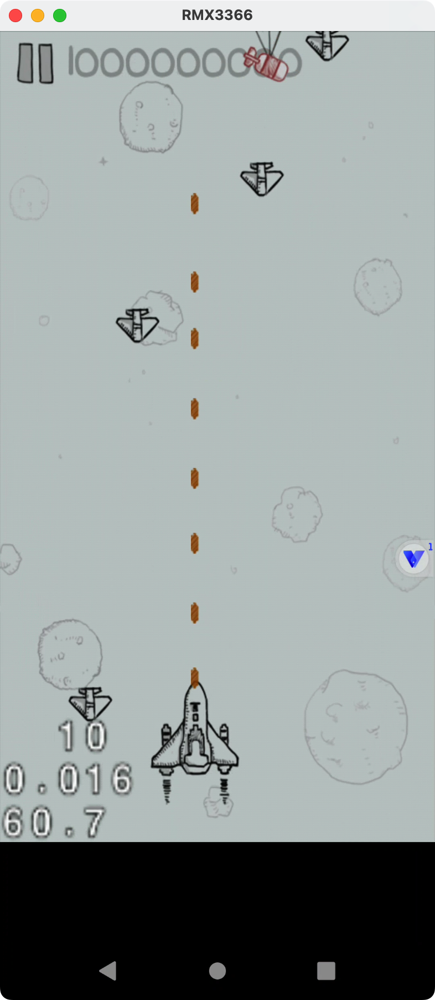

这题比较傻逼。

# Function

## Java

### FirstTest

```java
public class FirstTest extends Cocos2dxActivity {
    /* JADX INFO: Access modifiers changed from: protected */
    @Override // org.cocos2dx.lib.Cocos2dxActivity, android.app.Activity
    public void onCreate(Bundle savedInstanceState) {
        super.onCreate(savedInstanceState);
        a haha = new a(this, "flag");
        haha.d("YmF6aW5nYWFhYQ==");
        a hehe = new a(this, "Cocos2dxPrefsFile");
        hehe.d("N0");
    }

    @Override // org.cocos2dx.lib.Cocos2dxActivity
    public Cocos2dxGLSurfaceView onCreateView() {
        Cocos2dxGLSurfaceView glSurfaceView = new Cocos2dxGLSurfaceView(this);
        a hehe = new a(this, "Cocos2dxPrefsFile");
        hehe.d("MG");
        glSurfaceView.setEGLConfigChooser(5, 6, 5, 0, 16, 8);
        return glSurfaceView;
    }

    static {
        System.loadLibrary("cocos2dcpp");
    }
}
```

看看a这个类

### a

```java
public class a {
    private SharedPreferences editor;

    public a(Context arg1, String arg2) {
        this.editor = null;
        this.editor = arg1.getSharedPreferences(arg2, 0);
    }

    public void b() {
        this.editor.edit().putString("DATA", "").commit();
    }

    public String c() {
        return this.editor.getString("DATA", "");
    }

    public void d(String arg1) {
        this.editor.edit().putString("DATA", String.valueOf(String.valueOf(c())) + arg1).commit();
    }
}
```

等会直接hook

## Native

### ControlLayer::updateScore

```c
cocos2d::CCUserDefault *__fastcall ControlLayer::updateScore(cocos2d::CCUserDefault *this, const char *a2)
{
  int v2; // r3
  int v4; // r7
  cocos2d::CCUserDefault *v5; // r0
  int v6; // r5
  char *v7; // r0
  int v8; // r5
  int v9; // r5
  int v10; // r5
  int v11; // r5
  int v12; // r5
  int v13; // r5
  int v14; // r5
  int v15; // r5
  int v16; // r5
  int v17; // r0
  cocos2d::CCUserDefault *v18; // [sp+4h] [bp-64h]
  char v19[4]; // [sp+Ch] [bp-5Ch] BYREF
  char v20[4]; // [sp+10h] [bp-58h] BYREF
  char v21[4]; // [sp+14h] [bp-54h] BYREF
  char v22[4]; // [sp+18h] [bp-50h] BYREF
  char v23[4]; // [sp+1Ch] [bp-4Ch] BYREF
  char v24[4]; // [sp+20h] [bp-48h] BYREF
  char v25[4]; // [sp+24h] [bp-44h] BYREF
  char v26[4]; // [sp+28h] [bp-40h] BYREF
  char v27[4]; // [sp+2Ch] [bp-3Ch] BYREF
  char v28[4]; // [sp+30h] [bp-38h] BYREF
  char v29[4]; // [sp+34h] [bp-34h] BYREF
  char v30[4]; // [sp+38h] [bp-30h] BYREF
  char v31[4]; // [sp+3Ch] [bp-2Ch] BYREF
  char v32[8]; // [sp+40h] [bp-28h] BYREF
  int v33; // [sp+48h] [bp-20h] BYREF
  char v34; // [sp+4Ch] [bp-1Ch]

  strcpy(v32, "data");
  v2 = 0;
  v34 = 0;
  v18 = this;
  v33 = 0;
  do
  {
    *((_BYTE *)&v33 + v2) = v32[v2] ^ 0x20;
    ++v2;
  }
  while ( v2 != 4 );
  if ( (unsigned int)a2 <= 0x3B9ACA00 )
  {
    v4 = cocos2d::CCUserDefault::sharedUserDefault(this);
    sub_3A34D8(v21, &byte_3F92A0, v19);
    cocos2d::CCUserDefault::getStringForKey(v20, v4, &v33, v21);
    v5 = (cocos2d::CCUserDefault *)sub_3A1DDC(v21);
    if ( a2 == (const char *)&dword_64 )
    {
      v6 = cocos2d::CCUserDefault::sharedUserDefault(v5);
      std::operator+<char>(v22, v20, "MW");
      cocos2d::CCUserDefault::setStringForKey(v6, (const char *)&v33, (const char **)v22);
      v7 = v22;
    }
    else if ( a2 == (const char *)&stru_254.st_value )
    {
      v8 = cocos2d::CCUserDefault::sharedUserDefault(v5);
      std::operator+<char>(v23, v20, "Rf");
      cocos2d::CCUserDefault::setStringForKey(v8, (const char *)&v33, (const char **)v23);
      v7 = v23;
    }
    else if ( a2 == (const char *)&stru_2B4.st_size )
    {
      v9 = cocos2d::CCUserDefault::sharedUserDefault(v5);
      std::operator+<char>(v24, v20, "Rz");
      cocos2d::CCUserDefault::setStringForKey(v9, (const char *)&v33, (const char **)v24);
      v7 = v24;
    }
    else if ( a2 == (const char *)&stru_BB4.st_value )
    {
      v10 = cocos2d::CCUserDefault::sharedUserDefault(v5);
      std::operator+<char>(v25, v20, "Bt");
      cocos2d::CCUserDefault::setStringForKey(v10, (const char *)&v33, (const char **)v25);
      v7 = v25;
    }
    else if ( a2 == (const char *)&stru_15D4.st_info )
    {
      v11 = cocos2d::CCUserDefault::sharedUserDefault(v5);
      std::operator+<char>(v26, v20, "RV");
      cocos2d::CCUserDefault::setStringForKey(v11, (const char *)&v33, (const char **)v26);
      v7 = v26;
    }
    else if ( a2 == (const char *)&stru_26A4.st_size )
    {
      v12 = cocos2d::CCUserDefault::sharedUserDefault(v5);
      std::operator+<char>(v27, v20, "9Z");
      cocos2d::CCUserDefault::setStringForKey(v12, (const char *)&v33, (const char **)v27);
      v7 = v27;
    }
    else if ( a2 == (const char *)&stru_4644.st_info )
    {
      v13 = cocos2d::CCUserDefault::sharedUserDefault(v5);
      std::operator+<char>(v28, v20, "b1");
      cocos2d::CCUserDefault::setStringForKey(v13, (const char *)&v33, (const char **)v28);
      v7 = v28;
    }
    else if ( a2 == (const char *)&stru_15AD4.st_info )
    {
      v14 = cocos2d::CCUserDefault::sharedUserDefault(v5);
      std::operator+<char>(v29, v20, "Vf");
      cocos2d::CCUserDefault::setStringForKey(v14, (const char *)&v33, (const char **)v29);
      v7 = v29;
    }
    else if ( a2 == (const char *)&stru_18694.st_info )
    {
      v15 = cocos2d::CCUserDefault::sharedUserDefault(v5);
      std::operator+<char>(v30, v20, "S2");
      cocos2d::CCUserDefault::setStringForKey(v15, (const char *)&v33, (const char **)v30);
      v7 = v30;
    }
    else
    {
      if ( a2 != (const char *)1000000000 )
      {
LABEL_25:
        v17 = cocos2d::CCString::createWithFormat((cocos2d::CCString *)"%d", a2);
        (*(void (__fastcall **)(_DWORD, _DWORD))(**((_DWORD **)v18 + 66) + 428))(
          *((_DWORD *)v18 + 66),
          *(_DWORD *)(v17 + 20));
        return (cocos2d::CCUserDefault *)sub_3A1DDC(v20);
      }
      v16 = cocos2d::CCUserDefault::sharedUserDefault(v5);
      std::operator+<char>(v31, v20, "4w");
      cocos2d::CCUserDefault::setStringForKey(v16, (const char *)&v33, (const char **)v31);
      v7 = v31;
    }
    sub_3A1DDC(v7);
    goto LABEL_25;
  }
  return this;
}
```

主要就是这个函数，传入分数来添加字符串。

拼接起来是MWRfRzBtRV9Zb1VfS24w，base64解码为1d_G0mE_YoU_Kn0，应该是flag的中间部分。

# 算法

```javascript
function hook_test() {
    Java.perform(function () {
        let a = Java.use("com.example.plane.a");
        a["$init"].implementation = function (arg1, arg2) {
            console.log(`a.$init is called: arg1=${arg1}, arg2=${arg2}`);
            this["$init"](arg1, arg2);
        };

        a["b"].implementation = function () {
            console.log(`a.b is called`);
            this["b"]();
        };

        a["c"].implementation = function () {
            console.log(`a.c is called`);
            let result = this["c"]();
            console.log(`a.c result=${result}`);
            return result;
        };

        a["d"].implementation = function (arg1) {
            console.log(`a.d is called: arg1=${arg1}`);
            this["d"](arg1);
        };
    });
}

function hook_native(){
    Java.perform(function (){
       let addr_updateScore = Module.findExportByName("libcocos2dcpp.so", "_ZN12ControlLayer11updateScoreEi");
       console.log(addr_updateScore);
       if (addr_updateScore){
           Interceptor.attach(addr_updateScore, {
               onEnter:function (args){
                   console.log("addr_updateScore onEnter:", args[0],args[1]);
                   args[1] = ptr(0x3B9ACA00);
               },onLeave:function (retval){
                   console.log("addr_updateScore onLeave", retval);
               }
           });
       }

    });
}

function main() {
    hook_test();
    hook_native();
}

setImmediate(main);
```

## Java

### hook_test

```java
function hook_test() {
    Java.perform(function () {
        let a = Java.use("com.example.plane.a");
        a["$init"].implementation = function (arg1, arg2) {
            console.log(`a.$init is called: arg1=${arg1}, arg2=${arg2}`);
            this["$init"](arg1, arg2);
        };

        a["b"].implementation = function () {
            console.log(`a.b is called`);
            this["b"]();
        };

        a["c"].implementation = function () {
            console.log(`a.c is called`);
            let result = this["c"]();
            console.log(`a.c result=${result}`);
            return result;
        };

        a["d"].implementation = function (arg1) {
            console.log(`a.d is called: arg1=${arg1}`);
            this["d"](arg1);
        };
    });
}
```

先搞个零分(手速快点直接撞上去就行了)，hook到的结果是

```bash
(venv) dayu@dayudeMacBook-Air frida % frida -H 10.10.10.212:6666 -f com.example.plane -l test5.js
     ____
    / _  |   Frida 16.0.19 - A world-class dynamic instrumentation toolkit
   | (_| |
    > _  |   Commands:
   /_/ |_|       help      -> Displays the help system
   . . . .       object?   -> Display information about 'object'
   . . . .       exit/quit -> Exit
   . . . .
   . . . .   More info at https://frida.re/docs/home/
   . . . .
   . . . .   Connected to 10.10.10.212:6666 (id=socket@10.10.10.212:6666)
Spawned `com.example.plane`. Resuming main thread!                      
[Remote::com.example.plane ]-> null
a.$init is called: arg1=com.example.plane.FirstTest@fb5b0d6, arg2=Cocos2dxPrefsFile
a.d is called: arg1=MG
a.c is called
a.c result=MGN0ZntDMGNvUzJkX0FuRHJvdz99
a.$init is called: arg1=com.example.plane.FirstTest@fb5b0d6, arg2=flag
a.d is called: arg1=YmF6aW5nYWFhYQ==
a.c is called
a.c result=YmF6aW5nYWFhYQ==
a.$init is called: arg1=com.example.plane.FirstTest@fb5b0d6, arg2=Cocos2dxPrefsFile
a.d is called: arg1=N0
a.c is called
a.c result=MGN0ZntDMGNvUzJkX0FuRHJvdz99MG
Process terminated
[Remote::com.example.plane ]->

Thank you for using Frida!
(venv) dayu@dayudeMacBook-Air frida % 
```

MGN0ZntDMGNvUzJkX0FuRHJvdz99MG，0ctf{C0coS2d_AnDrow?}0，这他妈不就是开始和结尾？

再搞个几分看看是哪开始添加的，记得清除一下数据。

```java
(venv) dayu@dayudeMacBook-Air frida % frida -H 10.10.10.212:6666 -f com.example.plane -l test5.js
     ____
    / _  |   Frida 16.0.19 - A world-class dynamic instrumentation toolkit
   | (_| |
    > _  |   Commands:
   /_/ |_|       help      -> Displays the help system
   . . . .       object?   -> Display information about 'object'
   . . . .       exit/quit -> Exit
   . . . .
   . . . .   More info at https://frida.re/docs/home/
   . . . .
   . . . .   Connected to 10.10.10.212:6666 (id=socket@10.10.10.212:6666)
Spawned `com.example.plane`. Resuming main thread!                      
[Remote::com.example.plane ]-> null
a.$init is called: arg1=com.example.plane.FirstTest@fb5b0d6, arg2=Cocos2dxPrefsFile
a.d is called: arg1=MG
a.c is called
a.c result=MGN0ZntDMGNvUzJkX0FuRHJvMWdz99ZntDMGNvUzJkX0FuRHJv
a.$init is called: arg1=com.example.plane.FirstTest@fb5b0d6, arg2=flag
a.d is called: arg1=YmF6aW5nYWFhYQ==
a.c is called
a.c result=YmF6aW5nYWFhYQ==
a.$init is called: arg1=com.example.plane.FirstTest@fb5b0d6, arg2=Cocos2dxPrefsFile
a.d is called: arg1=N0
a.c is called
a.c result=MGN0ZntDMGNvUzJkX0FuRHJvMWdz99ZntDMGNvUzJkX0FuRHJvMG
Process terminated
[Remote::com.example.plane ]->

Thank you for using Frida!
(venv) dayu@dayudeMacBook-Air frida % 
```

```
MGN0ZntDMGNvUzJkX0FuRHJvMWdz99ZntDMGNvUzJkX0FuRHJvMG
MGN0ZntDMGNvUzJkX0FuRHJvdz99MG
MWRfRzBtRV9Zb1VfS24w
```

一眼丁真，MGN0ZntDMGNvUzJkX0FuRHJv + MWRfRzBtRV9Zb1VfS24w + dz99

MGN0ZntDMGNvUzJkX0FuRHJvMWRfRzBtRV9Zb1VfS24wdz99，解出来就是0ctf{C0coS2d_AnDro1d_G0mE_YoU_Kn0w?}

### hook_native

```javascript
function hook_native(){
    Java.perform(function (){
       let addr_updateScore = Module.findExportByName("libcocos2dcpp.so", "_ZN12ControlLayer11updateScoreEi");
       console.log(addr_updateScore);
       if (addr_updateScore){
           Interceptor.attach(addr_updateScore, {
               onEnter:function (args){
                   console.log("addr_updateScore onEnter:", args[0],args[1]);
                   args[1] = ptr(0x3B9ACA00);
               },onLeave:function (retval){
                   console.log("addr_updateScore onLeave", retval);
               }
           });
       }

    });
}
```

看了下ControlLayer::updateScore的逻辑，要1000000000才能得到flag，我尝试hook了它的传入分数，但是没用，因为他有很多个if判断，不能一下直接1000000000分。



只不过可以去主动调用这个函数，每次加100。

可以看这个文章 http://121.4.178.113/index.php/archives/301/