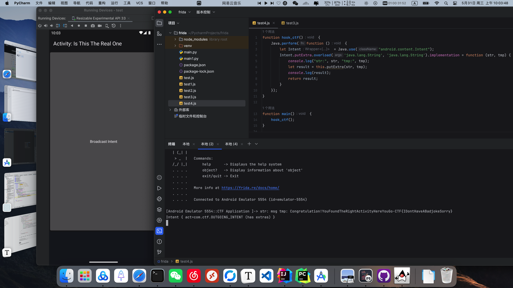
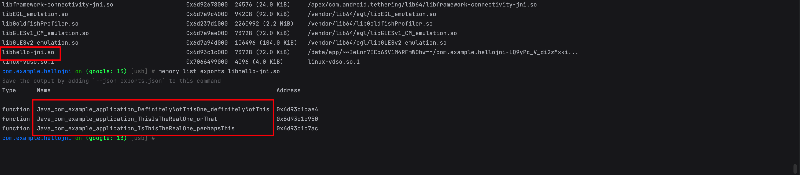
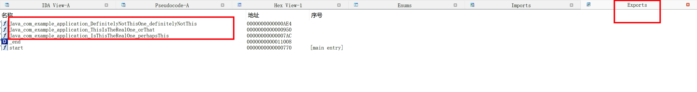
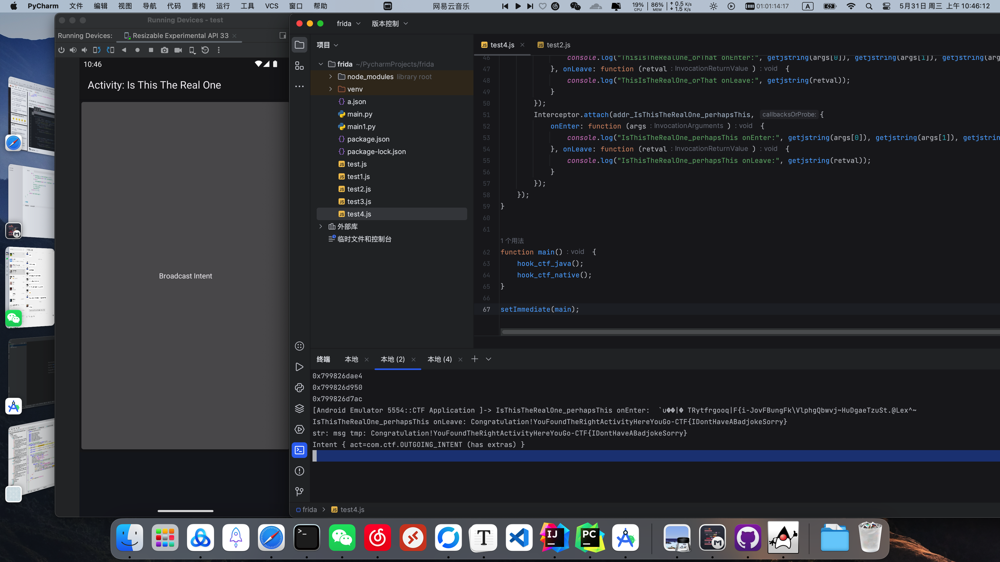

# Function

## MainActivity

```java
public class MainActivity extends Activity {
    @Override // android.app.Activity
    public void onCreate(Bundle savedInstanceState) {
        super.onCreate(savedInstanceState);
        TextView tv = new TextView(getApplicationContext());
        tv.setText("Select the activity you wish to interact with.To-Do: Add buttons to select activity, for now use Send_to_Activity");
        setContentView(tv);
        IntentFilter filter = new IntentFilter();
        filter.addAction("com.ctf.INCOMING_INTENT");
        Send_to_Activity receiver = new Send_to_Activity();
        registerReceiver(receiver, filter, Manifest.permission._MSG, null);
    }
}
```

只注册了一个广播，receiver是一个广播接收器，就是一个回调函数。

## Send_to_Activity

```java
public class Send_to_Activity extends BroadcastReceiver {
    @Override // android.content.BroadcastReceiver
    public void onReceive(Context context, Intent intent) {
        String msgText = intent.getStringExtra("msg");
        if (msgText.equalsIgnoreCase("ThisIsTheRealOne")) {
            Intent outIntent = new Intent(context, ThisIsTheRealOne.class);
            context.startActivity(outIntent);
        } else if (msgText.equalsIgnoreCase("IsThisTheRealOne")) {
            Intent outIntent2 = new Intent(context, IsThisTheRealOne.class);
            context.startActivity(outIntent2);
        } else if (msgText.equalsIgnoreCase("DefinitelyNotThisOne")) {
            Intent outIntent3 = new Intent(context, DefinitelyNotThisOne.class);
            context.startActivity(outIntent3);
        } else {
            Toast.makeText(context, "Which Activity do you wish to interact with?", 1).show();
        }
    }
}
```

处理了3个不同的消息，来启动3个不同的Activity。

## ThisIsTheRealOne

```java
public class ThisIsTheRealOne extends Activity {
    public native String computeFlag(String str, String str2);

    public native String definitelyNotThis(String str, String str2, String str3);

    public native String orThat(String str, String str2, String str3);

    public native String perhapsThis(String str, String str2, String str3);

    @Override // android.app.Activity
    public void onCreate(Bundle savedInstanceState) {
        super.onCreate(savedInstanceState);
        TextView tv = new TextView(this);
        tv.setText("Activity - This Is The Real One");
        Button button = new Button(this);
        button.setText("Broadcast Intent");
        setContentView(button);
        button.setOnClickListener(new View.OnClickListener() { // from class: com.example.application.ThisIsTheRealOne.1
            @Override // android.view.View.OnClickListener
            public void onClick(View v) {
                Intent intent = new Intent();
                intent.setAction("com.ctf.OUTGOING_INTENT");
                String a = ThisIsTheRealOne.this.getResources().getString(R.string.str2) + "YSmks";
                String b = Utilities.doBoth(ThisIsTheRealOne.this.getResources().getString(R.string.dev_name));
                String c = Utilities.doBoth(getClass().getName());
                intent.putExtra("msg", ThisIsTheRealOne.this.orThat(a, b, c));
                ThisIsTheRealOne.this.sendBroadcast(intent, Manifest.permission._MSG);
            }
        });
    }

    static {
        System.loadLibrary("hello-jni");
    }
}
```

3个Active都差不多，都在Native调用了一个函数，由于这个app并没有输入，所以flag可能就在Native层产生的。

```
ThisIsTheRealOne->orThat
IsThisTheRealOne->perhapsThis
DefinitelyNotThisOne->definitelyNotThis
```

# 算法

OK，既然这样那我们把Java层和Native层都分析一遍。

## Java



Java层直接hook intent.putExtra就行了。

```bash
objection -g com.example.hellojni explore
android intent launch_activity com.example.application.IsThisTheRealOne
```

```javascript
function hook_ctf() {
    Java.perform(function () {
        let Intent = Java.use("android.content.Intent");
        Intent.putExtra.overload('java.lang.String', 'java.lang.String').implementation = function (str, tmp) {
            console.log("str:", str, "tmp:", tmp);
            let result = this.putExtra(str, tmp);
            console.log(result);
            return result;
        }
    });
}

function main() {
    hook_ctf();
}

setImmediate(main);
```

## Native






objection针不戳。



```javascript
function hook_ctf_java() {
    Java.perform(function () {
        let Intent = Java.use("android.content.Intent");
        Intent.putExtra.overload('java.lang.String', 'java.lang.String').implementation = function (str, tmp) {
            console.log("str:", str, "tmp:", tmp);
            let result = this.putExtra(str, tmp);
            console.log(result);
            return result;
        }
    });
}

function hook_ctf_native() {
    function getjstring(jstr) {
        return Java.vm.getEnv().getStringUtfChars(jstr, null).readCString();
    }

    Java.perform(function () {
        // let module_libhello = Process.findModuleByName("libhello-jni.so")
        // let exports_libhello = module_libhello.enumerateExports()
        // for (let i = 0; i < exports_libhello.length; i++) {
        //     console.log(exports_libhello[i].name);
        //     /*
        //     Java_com_example_application_DefinitelyNotThisOne_definitelyNotThis
        //     Java_com_example_application_ThisIsTheRealOne_orThat
        //     Java_com_example_application_IsThisTheRealOne_perhapsThis
        //     */
        // }

        let addr_DefinitelyNotThisOne_definitelyNotThis = Module.findExportByName("libhello-jni.so", "Java_com_example_application_DefinitelyNotThisOne_definitelyNotThis");
        console.log(addr_DefinitelyNotThisOne_definitelyNotThis);
        let addr_ThisIsTheRealOne_orThat = Module.findExportByName("libhello-jni.so", "Java_com_example_application_ThisIsTheRealOne_orThat");
        console.log(addr_ThisIsTheRealOne_orThat);
        let addr_IsThisTheRealOne_perhapsThis = Module.findExportByName("libhello-jni.so", "Java_com_example_application_IsThisTheRealOne_perhapsThis");
        console.log(addr_IsThisTheRealOne_perhapsThis);

        Interceptor.attach(addr_DefinitelyNotThisOne_definitelyNotThis, {
            onEnter: function (args) {
                console.log("DefinitelyNotThisOne_definitelyNotThis onEnter:", getjstring(args[0]), getjstring(args[1]));
            }, onLeave: function (retval) {
                console.log("DefinitelyNotThisOne_definitelyNotThis onLeave:", getjstring(retval));
            }
        });
        Interceptor.attach(addr_ThisIsTheRealOne_orThat, {
            onEnter: function (args) {
                console.log("ThisIsTheRealOne_orThat onEnter:", getjstring(args[0]), getjstring(args[1]), getjstring(args[2]));
            }, onLeave: function (retval) {
                console.log("ThisIsTheRealOne_orThat onLeave:", getjstring(retval));
            }
        });
        Interceptor.attach(addr_IsThisTheRealOne_perhapsThis, {
            onEnter: function (args) {
                console.log("IsThisTheRealOne_perhapsThis onEnter:", getjstring(args[0]), getjstring(args[1]), getjstring(args[2]));
            }, onLeave: function (retval) {
                console.log("IsThisTheRealOne_perhapsThis onLeave:", getjstring(retval));
            }
        });
    });
}


function main() {
    hook_ctf_java();
    hook_ctf_native();
}

setImmediate(main);
```

OK.