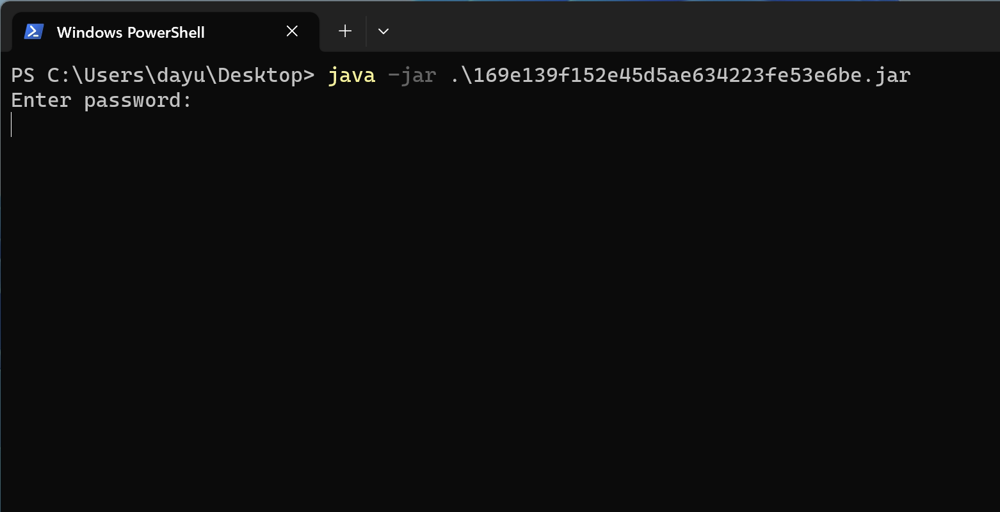

搜索关键字 Enter password:

# Function

## main

```java
    public static void main(String[] args) throws ClassNotFoundException, InstantiationException, IllegalAccessException, IOException, NoSuchAlgorithmException, NoSuchPaddingException, InvalidKeyException, IllegalBlockSizeException, BadPaddingException {
        CheckInterface checkerObject = loadCheckerObject();
        BufferedReader stdin = new BufferedReader(new InputStreamReader(System.in));
        while (true) {
            System.out.println("Enter password:");
            String line = stdin.readLine();
            if (checkerObject.checkPassword(line)) {
                System.out.println("Well done, that is the correct password");
                System.exit(0);
            } else {
                System.out.println("Incorrect password");
            }
        }
    }
```

## checkPassword

```java
public class CheckPass implements CheckInterface {
    @Override // defpackage.CheckInterface
    public boolean checkPassword(String input) {
        MessageDigest md5Obj = null;
        try {
            md5Obj = MessageDigest.getInstance("MD5");
        } catch (NoSuchAlgorithmException e) {
            System.out.println("Hash Algorithm not supported");
            System.exit(-1);
        }
        byte[] bArr = new byte[40];
        md5Obj.update(input.getBytes(), 0, input.length());
        byte[] hashBytes = md5Obj.digest();
        return byteArrayToHexString(hashBytes).equals("fa3733c647dca53a66cf8df953c2d539");	//直接equals了
    }

    private static String byteArrayToHexString(byte[] data) {
        int i;
        StringBuffer buf = new StringBuffer();
        for (int i2 = 0; i2 < data.length; i2++) {
            int halfbyte = (data[i2] >>> 4) & 15;
            int two_halfs = 0;
            do {
                if (halfbyte >= 0 && halfbyte <= 9) {
                    buf.append((char) (48 + halfbyte));
                } else {
                    buf.append((char) (97 + (halfbyte - 10)));
                }
                halfbyte = data[i2] & 15;
                i = two_halfs;
                two_halfs++;
            } while (i < 1);
        }
        return buf.toString();
    }
}
```

# 算法

查询结果：  monkey99